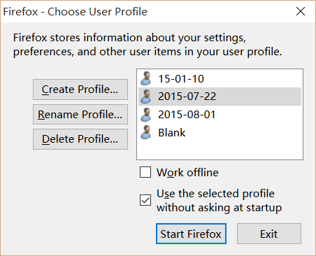

Firefox如何在多个配置间仅导出书签（包括书签的tags）、历史记录和下载记录
=================================================================

Firefox常用配置管理方法：
-----------------------
Firefox的用户配置全部在用户文件夹里面，因此可以非常方便地转移和备份。可以在地址栏
输入`about:support`后，找到`Application Basics`里面的`Profile Folder`部份，
点击`Show Folder`按钮进入到当前配置文件夹。

或者在Firefox快捷方式上点击右键属性，在`目标(T)`处的Firefox可执行文件路径后面增加
参数`-p`，打开配置管理器：

    "C:\Program Files (x86)\Mozilla Firefox\firefox.exe" -p

配置管理器截图：

如何仅导出书签、历史记录和文件下载记录：
-----------------------------------
但是有时候仅需要导出书签（包含tags）和历史记录，而不需要其他的配置，例如目前的配置出现
问题或者性能低下，想要新建配置的时候。使用Firefox自身提供的网络同步是一种方法，但是并不好用。
其实可以直接从老的配置目录中拷贝`places.sqlite`文件到新目录覆盖即可。

`places.sqlite`是Firefox用于存储书签和历史记录的SQLite数据库文件。

注意：执行覆盖前需要关闭Firefox。

参考链接：

<https://support.mozilla.org/en-US/questions/1011545>
<https://support.mozilla.org/zh-CN/kb/%E7%94%A8%E6%88%B7%E9%85%8D%E7%BD%AE%E6%96%87%E4%BB%B6>